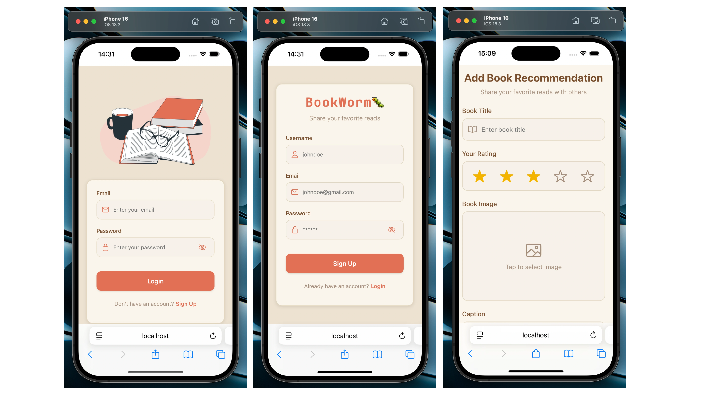

# BookWorm - Full Stack React Native App

Applicazione mobile per gestire e organizzare la tua collezione di libri preferiti. Aggiungi titoli, scrivi recensioni personali, valuta i tuoi libri e tieni traccia delle tue letture preferite.

## Tech

- **React Native**
- **Expo**
- **TypeScript**
- **Zustand** (State management)
- **Express**
- **MongoDB** con Mongoose
- **JWT**
- **bcryptjs**
- **cron** (Scheduling di task automatici)
- **Dicebear.com** API ( to randomly generate users avatar images)
- **Cloudinary** (Images Storage)

